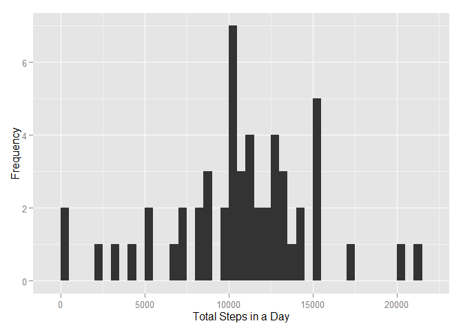
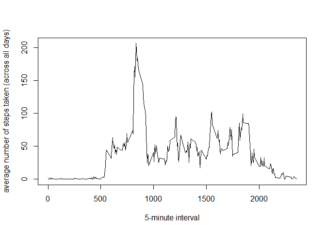
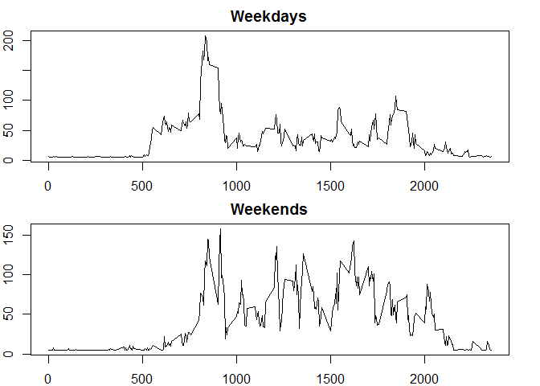

# Reproducible Research: Peer Assessment 1


## Loading and preprocessing the data


```r
library(ggplot2)
library(dplyr)
library(Hmisc)
```
Here, we load the data into R, processing it slightly so that date and interval are factors and date is the first column of activity.

```r
activity <- read.csv(file = "./activity-XX/activity.csv")
activity$date = as.factor(activity$date)
activity$interval = as.factor(activity$interval)
activity <- activity[, c(2,3,1)]
head(activity)
```

```
##         date interval steps
## 1 2012-10-01        0    NA
## 2 2012-10-01        5    NA
## 3 2012-10-01       10    NA
## 4 2012-10-01       15    NA
## 5 2012-10-01       20    NA
## 6 2012-10-01       25    NA
```
## What is mean total number of steps taken per day?
We start by calculating the total number of steps taken in a day for each day. We ignore NAs by setting na.rm = TRUE.

```r
stepsPerDay <- aggregate(steps ~ date, FUN = sum, na.rm = TRUE, data = activity)
head(stepsPerDay)
```

```
##         date steps
## 1 2012-10-02   126
## 2 2012-10-03 11352
## 3 2012-10-04 12116
## 4 2012-10-05 13294
## 5 2012-10-06 15420
## 6 2012-10-07 11015
```
Next, we make a histogram that shows the distribution of the total number of steps in a day.

```r
qplot(stepsPerDay$steps, 
      binwidth = 500, 
      xlab = "Total Steps in a Day", 
      ylab = "Frequency")
```

 

Finally, here are the mean and median of the total number of steps taken in a day.

```r
mean(stepsPerDay$steps)
```

```
## [1] 10766.19
```

```r
median(stepsPerDay$steps)
```

```
## [1] 10765
```

## What is the average daily activity pattern?
Here, we start by finding the mean number of steps for each time interval, averaged accross all days.

```r
dailyActivity <- aggregate(steps ~ interval, FUN = mean, na.rm = TRUE, data = activity)
head(dailyActivity)
```

```
##   interval     steps
## 1        0 1.7169811
## 2        5 0.3396226
## 3       10 0.1320755
## 4       15 0.1509434
## 5       20 0.0754717
## 6       25 2.0943396
```
To illustrate our findings, we present a time series plot, this time made with the base plotting system.

```r
plot(as.numeric(as.character(dailyActivity$interval)),
     dailyActivity$steps,
     type = "l", 
     xlab = "5-minute interval", 
     ylab = "average number of steps taken (across all days)")
```

 

Let's now find the time interval in dailyActivity that corresponds to the maximum number of steps taken.

```r
as.numeric(as.character(dailyActivity[which.max(dailyActivity$steps), 1]))
```

```
## [1] 835
```

## Imputing missing values

We calculate the total number of NAs in the activity data.

```r
sum(is.na(activity))
```

```
## [1] 2304
```
We now built a new data set, identical to activity, except that the NAs in the step column (which account for all the NAs in activity) have been imputed using the mean of the step column.

```r
imputedActivity <- activity
imputedActivity$steps <- impute(activity$steps, mean)
head(imputedActivity)
```

```
##         date interval   steps
## 1 2012-10-01        0 37.3826
## 2 2012-10-01        5 37.3826
## 3 2012-10-01       10 37.3826
## 4 2012-10-01       15 37.3826
## 5 2012-10-01       20 37.3826
## 6 2012-10-01       25 37.3826
```
Once again, we compute the total number of steps taken each day.

```r
stepsPerDay2 <- aggregate(steps ~ date, FUN = sum, data = activity)
head(stepsPerDay2)
```

```
##         date steps
## 1 2012-10-02   126
## 2 2012-10-03 11352
## 3 2012-10-04 12116
## 4 2012-10-05 13294
## 5 2012-10-06 15420
## 6 2012-10-07 11015
```
Here is a histogram showing the distribution of the total numer of steps taken in a day.

```r
qplot(stepsPerDay2$steps, 
      binwidth = 500, 
      xlab = "Total Steps in a Day", 
      ylab = "Frequency")
```

 

Finally, here are the mean and median of the total number of steps taken each day.

```r
mean(stepsPerDay2$steps)
```

```
## [1] 10766.19
```

```r
median(stepsPerDay2$steps)
```

```
## [1] 10765
```
The new histogram looks much like the previous one and the mean and median have not changed, so the impact of imputing the NAs as we've done appear minimal.

## Are there differences in activity patterns between weekdays and weekends?

We now augment the imputedData another column, which is a factor with two levels: "weekday" and "weekend".

```r
Dates <- as.Date(as.character(imputedActivity$date))
typeOfDay <- as.factor(ifelse(weekdays(Dates) %in% c("Saturday", "Sunday"), 
                         "weekend", 
                         "weekday"))
imputedActivity <- mutate(imputedActivity, typeOfDay = typeOfDay)
imputedActivity <- imputedActivity[, c(1,4,3,2)]
head(imputedActivity)
```

```
##         date typeOfDay   steps interval
## 1 2012-10-01   weekday 37.3826        0
## 2 2012-10-01   weekday 37.3826        5
## 3 2012-10-01   weekday 37.3826       10
## 4 2012-10-01   weekday 37.3826       15
## 5 2012-10-01   weekday 37.3826       20
## 6 2012-10-01   weekday 37.3826       25
```
Let's now averge the number steps taken in each 5-minute interval across typeofDay.

```r
stepsByTypeOfDay <- aggregate(steps ~ interval + typeOfDay, 
                              data = imputedActivity,
                              FUN = mean)
```
Finally, let's build a panel plot to compare activity on weekends with activity on weekdays.

```r
weekdayActivity <- stepsByTypeOfDay %>% mutate(interval =  as.numeric(as.character(interval))) %>% filter(typeOfDay == "weekday") %>% select(interval, steps)

weekendActivity <- stepsByTypeOfDay %>% mutate(interval = as.numeric(as.character(interval))) %>% filter(typeOfDay == "weekend") %>% select(interval, steps)

par (mfrow = c(2,1), mar = c(2,2,2,2))
plot(weekdayActivity, type = "l",
     main = "Weekdays")
     
plot(weekendActivity, type = "l",
     main = "Weekends")
```

 
